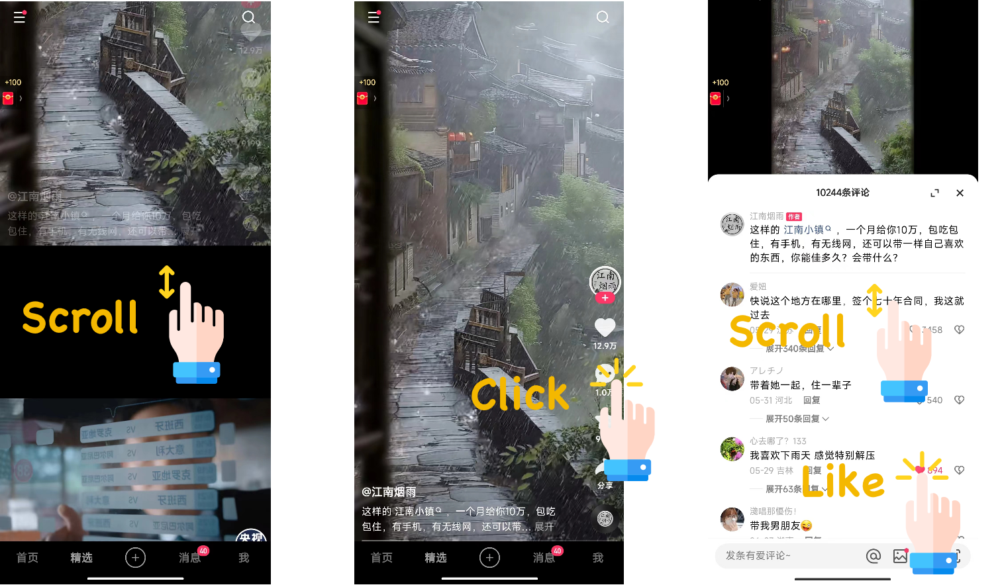

# KuaiComt

*KuaiComt* is a comprehensive short video recommendation dataset that includes abundant comment text and interaction data. It contains real user behavior logs collected from the short-video mobile app [Kuaishou](https://www.kuaishou.com/en), a leading short video app in China with over 400 million daily active users. On average, users spend over 120 minutes on the app each day, with more than 7 minutes (over 5%) spent in the video comments section. The comments section boasts a UV penetration rate of over 60%.

**This is the first recommendation dataset that not only records item text and interaction data but also includes abundant comment text and interaction data!**


## Overview

The following figure provides an example of the dataset. When users enter the app, they can scroll up and down to browse different videos. Additionally, users can click the comment button on the right side of the video to enter the comments section, where they can scroll through comments and engage in interactive behaviors such as likes and replies.




## Download the data:

KuaiComt has been shared at [https://zenodo.org/record/8181109](https://zenodo.org/record/8181109).

[](https://doi.org/10.5281/zenodo.8181109)

OPTION 1. Download via your browser:

You can download the dataset from this [link](https://zenodo.org/record/8181109).

**Note:**

* The 'KuaiComt.zip' file is for the complete **KuaiComt** dataset.


OPTION 2: Download via the 'wget' command tool:

For the **KuaiComt** dataset:
```bash
wget https://zenodo.org/record/8181109/files/KuaiComt.zip

unzip KuaiComt.zip
```

## Citation

If you find it helpful, please cite our paper:
 [](https://arxiv.org/abs/2306.07705) [](https://arxiv.org/pdf/2306.07705.pdf)

```

```

## License

[![CC BY-NC-SA 4.0][cc-by-nc-sa-shield]][cc-by-nc-sa]

This work is licensed under a
[Creative Commons Attribution-NonCommercial-ShareAlike 4.0 International License][cc-by-nc-sa].

[![CC BY-NC-SA 4.0][cc-by-nc-sa-image]][cc-by-nc-sa]

[cc-by-nc-sa]: http://creativecommons.org/licenses/by-nc-sa/4.0/
[cc-by-nc-sa-image]: https://licensebuttons.net/l/by-nc-sa/4.0/88x31.png
[cc-by-nc-sa-shield]: https://img.shields.io/badge/License-CC%20BY--NC--SA%204.0-lightgrey.svg

