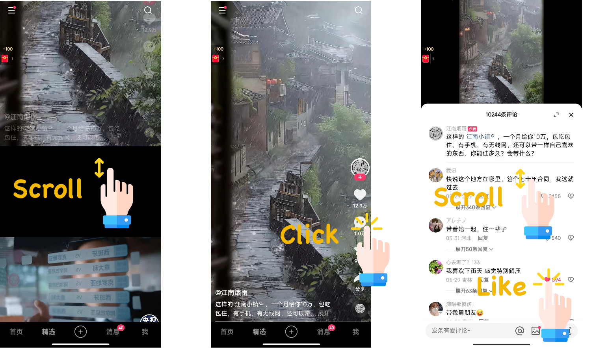

# KuaiComt

*KuaiComt* is a comprehensive short video recommendation dataset that includes abundant comment text and interaction data. It contains real user behavior logs collected from the short-video mobile app [Kuaishou](https://www.kuaishou.com/en), a leading short video app in China with over 400 million daily active users. On average, users spend over 120 minutes on the app each day, with more than 7 minutes (over 5%) spent in the video comments section. The comments section boasts a UV penetration rate of over 60%.

**This is the first recommendation dataset that not only records item text and interaction data but also includes abundant comment text and interaction data!**


## Overview

The following figure provides an example of the dataset. When users enter the app, they can scroll up and down to browse different videos. Additionally, users can click the comment button on the right side of the video to enter the comments section, where they can scroll through comments and engage in interactive behaviors such as likes and replies.




The other related datasets are: [KuaiRec](https://kuairec.com/), [KuaiRand](https://kuairand.com/) and [KuaiSAR](https://kuaisar.github.io/).

### Advantages:

Compared with other existing datasets, KuaiComt has the following advantages:

- ✅ It is the first dataset that includes real user interaction behavior with comments.
- ✅ It contains abundant text features, such as video caption text and comment content text.
- ✅ It has the most comprehensive side information, including explicit user IDs, video IDs, comment IDs, interaction timestamps, and their abundant features.
- ✅ It provides various feedback signals (such as clicks, likes, and watch time for videos, and likes and replies for comments) for each interaction with videos and comments to describe comprehensive user feedback.

### Statistics

Here we show some basic statistics.
Check this page for more detailed [Descriptions](./detailed_statistics.html).

KuaiComt contains the real behavior of 34,701 users on the Kuaishou app from September 30, 2023, to November 3, 2023. Due to the large number of comment impressions to users, we only provide data on user interactions with comments (likes and replies). Videos with fewer than 55 comments and comments with fewer than 2 interactions were filtered out. Additionally, video titles and comment texts were anonymized.

Basic statistics of this dataset in the are summarized as follows:

**KuaiComt**

<style>
table {
  width: 80%;
  margin-left: auto;
  margin-right: auto;
}
</style>

| Dataset | #Users  | #Videos | #Comments | #Impressions-V | #OpenComments-V | Interactions-C |
|---------|---------|------------|---------|------------|------------|------------|
| KuaiComt | 34,701 | 82,452 | 16,352,904 | 119,696,682 | 16,033,443 | 1,002,672 |

where 'Impressions-V' denotes the impressions of videos to users, 'OpenComments-V' denotes the behavior of users opening the comments section, and 'Interactions-C' denotes user interactions with comments (such as likes or replies).

The short descriptions for each feature filed are listed as below. Please refer to this [page](./detailed_statistics.html) for more details and examples.

| **Feature**  | Detailed Descriptions. |
|------------------------|---------------------------------------------------------------------------------------|
| **User feature**  | Users have abundant side information, e.g., user active degree, follow count. |
| **Video feature** | Videos have abundant side information, e.g., caption, duration. |
| **Comment feature** | Comments have abundant side information, e.g., comment content, comment like cnt. |
| **V-inter feature** | Video-interactions have 12 features, e.g., comment stay time, play time, likes, and follows. |
| **C-inter feature** | Comment-interactions has 2 features, including 2 types of user feedback: likes and replies. |

## Download the data:

KuaiComt has been shared at [https://zenodo.org/record/13922581](https://zenodo.org/uploads/13922581).

[](https://doi.org/10.5281/zenodo.13922581)

OPTION 1. Download via your browser:

You can download the dataset from this [link](https://zenodo.org/uploads/13922581).

OPTION 2: Download via the 'wget' command tool:

For the **KuaiComt** dataset:

```bash
wget https://zenodo.org/record/13922581/files/KuaiComt.zip

unzip KuaiComt.zip
```

[![CC BY-NC-SA 4.0][cc-by-nc-sa-shield]][cc-by-nc-sa]

This work is licensed under a
[Creative Commons Attribution-NonCommercial-ShareAlike 4.0 International License][cc-by-nc-sa].

[![CC BY-NC-SA 4.0][cc-by-nc-sa-image]][cc-by-nc-sa]

[cc-by-nc-sa]: http://creativecommons.org/licenses/by-nc-sa/4.0/
[cc-by-nc-sa-image]: https://licensebuttons.net/l/by-nc-sa/4.0/88x31.png
[cc-by-nc-sa-shield]: https://img.shields.io/badge/License-CC%20BY--NC--SA%204.0-lightgrey.svg


## Contact

If you have any questions, please feel free to contact us through [github issues](https://github.com/KuaiSAR/KuaiSAR.github.io/issues) or emails (zhangchangshuo@kuaishou.com)

## Citation

If you find it helpful, please cite our website (https://kuaicomt.github.io)

```

```
